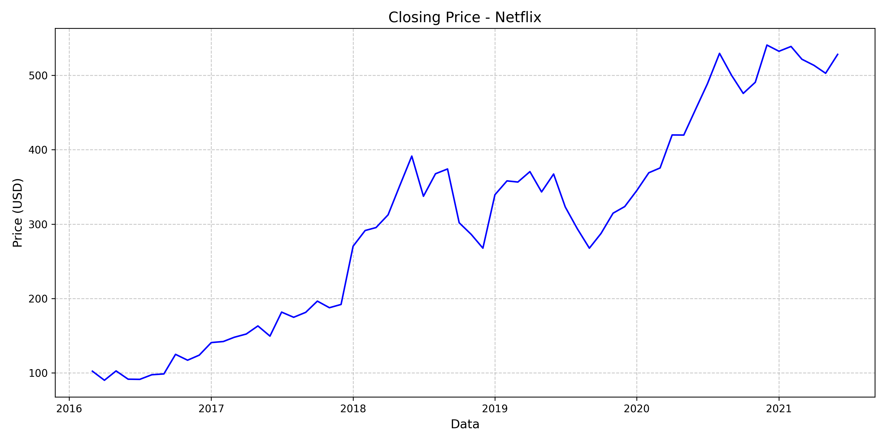
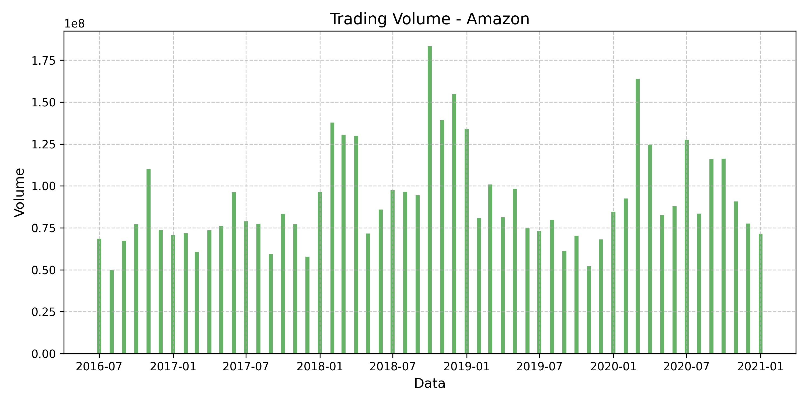
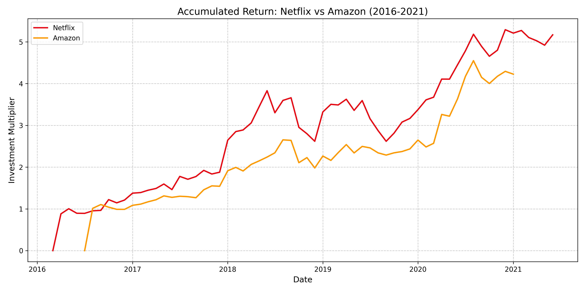
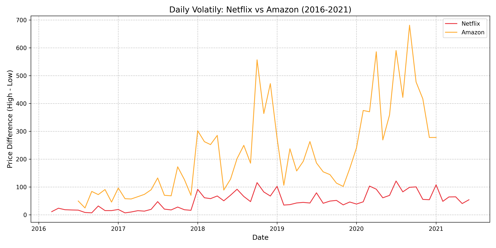

# 🎬 Netflix vs Amazon Stock Analysis – Final Web Scraping Project


### A web scraping and data analysis project developed as part of the IBM Web Scraping with Python course, comparing historical stock data from **Netflix** and **Amazon** using Python and HTML parsing.

---

## 📋 Project Overview

This repository was created as a final project for the **IBM Web Scraping with Python** course. It performs web scraping of historical stock price data from two static HTML pages representing **Netflix (NFLX)** and **Amazon (AMZN)**.

The project includes:

- Automated scraping of HTML tables using BeautifulSoup.
- Cleaning and formatting of historical stock data.
- Individual analysis and visualizations for each company.
- Comparative analysis of volatility, trading volume, and cumulative returns.
- Python scripts to reproduce each step.

---

## 🎯 Objectives

- Collect stock data from static HTML sources.
- Clean, organize and convert raw financial data into usable format.
- Generate and save individual and comparative visualizations.
- Compare trends and behaviors between Netflix and Amazon stocks.

---

## 🧰 Technologies Used

- Python 3.10+
- pandas
- matplotlib
- requests
- BeautifulSoup
- Jupyter Notebook (optional)

---

## 📸 Sample Visualizations

### 📈 Individual Company Analysis

#### Netflix – Closing Price
<div align="center">
  
  <p>Figure 1: Netflix stock closing price over time</p>
</div>

#### Amazon – Volume of Trades
<div align="center">
  
  <p>Figure 2: Amazon stock trading volume over time</p>
</div>

---

### 📊 Comparative Analysis

#### Accumulated Return
<div align="center">
  
  <p>Figure 3: Cumulative investment return comparison between Netflix and Amazon</p>
</div>

#### Volatility Over Time
<div align="center">
  
  <p>Figure 4: Monthly volatility (High - Low) comparison between the two companies</p>
</div>

---

## ▶️ How to Run

1. **Clone the repository**
```bash
git clone https://github.com/YourUsername/netflix-amazon-stock-analysis
cd netflix-amazon-stock-analysis
```
2. **Install Dependencies**
```bash
pip install -r requirements.txt
```
## 👨‍💻 Author
Lucas Galvano de Paula

## 📝 License
This project is part of the IBM Web Scraping with Python course and is intended for educational purposes only.
